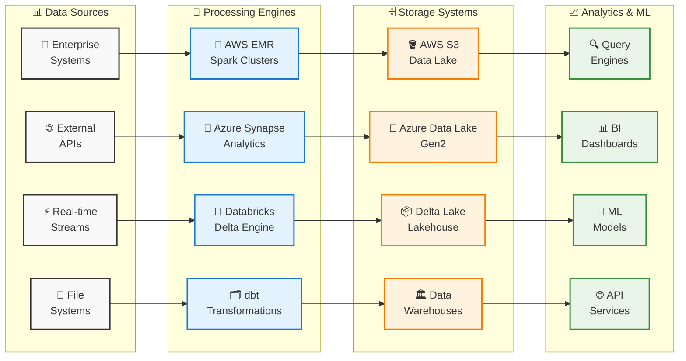

# Cloud Platform Solutions

Multi-cloud data platform implementations across AWS, Azure, and Databricks.

## Architecture

### Multi-Cloud Data Platform Flow



### Medallion Architecture Implementation

```
┌─────────────────────────────────────────────────────────────────┐
│                    🥉 BRONZE LAYER (Raw Data)                   │
├─────────────────────────────────────────────────────────────────┤
│  📥 Data Ingestion    │  🗂️ Schema Evolution   │  🔄 Change Data  │
│  • JSON, CSV, Avro   │  • Auto-detection      │  • CDC Streams   │
│  • Parquet, ORC      │  • Schema registry     │  • Event logs    │
│  • Binary files      │  • Backward compat     │  • Audit trails  │
└─────────────────────────────────────────────────────────────────┘
                                   ↓
┌─────────────────────────────────────────────────────────────────┐
│                   🥈 SILVER LAYER (Refined Data)                │
├─────────────────────────────────────────────────────────────────┤
│  ✅ Data Quality      │  🔧 Transformations    │  📊 Standardized │
│  • Validation rules  │  • Business logic      │  • Common schema │
│  • Deduplication     │  • Data cleansing      │  • Type safety   │
│  • Null handling     │  • Aggregations        │  • Optimized     │
└─────────────────────────────────────────────────────────────────┘
                                   ↓
┌─────────────────────────────────────────────────────────────────┐
│                   🥇 GOLD LAYER (Business Ready)                │
├─────────────────────────────────────────────────────────────────┤
│  📈 Analytics Ready   │  🤖 ML Features        │  🎯 Use Case     │
│  • Star schema       │  • Feature engineering │  • Customer 360° │
│  • Dimensional model │  • Training datasets   │  • Real-time KPIs│
│  • Aggregated views  │  • Model serving       │  • Executive dash│
└─────────────────────────────────────────────────────────────────┘
```

### Data Flow Patterns
- **Ingestion**: Event streaming and batch processing across multiple clouds
- **Processing**: Apache Spark, Delta Lake, real-time analytics with unified compute
- **Storage**: Multi-cloud data lakes with medallion architecture (Bronze/Silver/Gold)
- **Analytics**: Business intelligence, machine learning, and real-time applications

## Platforms

### AWS (`aws/`)
- **EMR**: Managed Spark processing
- **Glue**: Serverless ETL
- **S3**: Data lake storage
- **EKS**: Kubernetes job orchestration

### Azure (`azure/`)
- **Data Factory**: ETL/ELT orchestration
- **SQL Database**: Data warehouse
- **Data Lake Storage**: Scalable storage

### Databricks (`databricks/`)
- **Delta Live Tables**: Real-time streaming with Kafka
- **Medallion Architecture**: Bronze/Silver/Gold layers
- **MLflow**: ML lifecycle management
- **Unity Catalog**: Data governance

### dbt (`dbt/`)
- **Data Transformation**: SQL-based transformations
- **Testing**: Data quality validation
- **Documentation**: Automated data lineage

## Architecture Patterns

### Medallion Architecture
```
Bronze (Raw) → Silver (Refined) → Gold (Business-Ready)
```

### Real-Time Processing
- Event-driven architecture
- Stream processing with Apache Spark
- Delta Live Tables for CDC

### Batch Processing
- Scheduled data pipelines
- ETL orchestration
- Data quality monitoring

## Key Features

- **Multi-cloud deployment** patterns
- **Real-time streaming** with Kafka integration
- **Data quality** validation and monitoring
- **Security** with encryption and access controls
- **Cost optimization** with lifecycle management
- **DevOps integration** with Infrastructure as Code