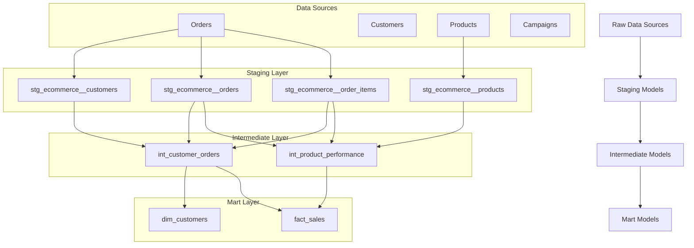

# dbt E-commerce Analytics Project

[](https://www.getdbt.com/)
[](https://www.getdbt.com/docs/supported-databases)
[](https://www.python.org/)

> **A comprehensive dbt project demonstrating modern data transformation patterns for e-commerce analytics**

This dbt project transforms raw e-commerce data into analytics-ready datasets using industry best practices. It showcases data modeling techniques, testing strategies, and documentation approaches for building production-grade data warehouses.

## 🎯 Project Overview

This dbt project implements a complete e-commerce analytics solution with:

- **Medallion Architecture**: Bronze (raw) → Silver (cleaned) → Gold (analytics-ready)
- **Dimensional Modeling**: Star schema with facts and dimensions
- **Data Quality**: Comprehensive testing and validation
- **Business Logic**: Customer segmentation, RFM analysis, and performance metrics
- **Multi-Platform Support**: Works with BigQuery, Snowflake, Postgres, Databricks

## 🏗️ Architecture



## 📁 Project Structure

```
dbt/
├── 📄 dbt_project.yml              # Project configuration
├── 📄 profiles.yml                 # Database connections
├── 📄 packages.yml                 # Package dependencies
├── 📄 README.md                    # This file
│
├── 📂 models/
│   ├── 📂 staging/                 # Raw data cleaning & standardization
│   │   └── 📂 ecommerce/
│   │       ├── _ecommerce__sources.yml
│   │       ├── stg_ecommerce__customers.sql
│   │       ├── stg_ecommerce__orders.sql
│   │       ├── stg_ecommerce__order_items.sql
│   │       └── stg_ecommerce__products.sql
│   │
│   ├── 📂 intermediate/            # Business logic & calculations
│   │   ├── int_customer_orders.sql
│   │   └── int_product_performance.sql
│   │
│   └── 📂 marts/                   # Analytics-ready models
│       └── 📂 core/
│           ├── _models.yml
│           ├── dim_customers.sql
│           └── fact_sales.sql
│
├── 📂 macros/                      # Reusable SQL functions
│   ├── business_logic.sql
│   └── logging.sql
│
├── 📂 tests/                       # Custom data tests
│   └── 📂 generic/
│       ├── test_valid_email.sql
│       └── test_reasonable_values.sql
│
├── 📂 seeds/                       # Static reference data
├── 📂 snapshots/                   # SCD Type 2 tracking
└── 📂 analyses/                    # Ad-hoc analysis queries
```

## 🚀 Quick Start

### Prerequisites

```bash
# Install dbt
pip install dbt-core dbt-bigquery dbt-snowflake dbt-postgres

# Verify installation
dbt --version
```

### Setup

1. **Clone and Navigate**
   ```bash
   cd "Cloud Platform/dbt"
   ```

2. **Install Dependencies**
   ```bash
   dbt deps
   ```

3. **Configure Connection**
   ```bash
   # Edit profiles.yml with your database credentials
   dbt debug
   ```

4. **Run the Project**
   ```bash
   # Full refresh
   dbt run --full-refresh
   
   # Run tests
   dbt test
   
   # Generate documentation
   dbt docs generate
   dbt docs serve
   ```

## 📊 Data Models

### Staging Models

| Model | Description | Key Features |
|-------|-------------|--------------|
| `stg_ecommerce__customers` | Customer master data | Email validation, name standardization, data quality scoring |
| `stg_ecommerce__orders` | Order transactions | Status categorization, temporal analysis, currency conversion |
| `stg_ecommerce__order_items` | Order line items | Price calculations, discount analysis, validation |
| `stg_ecommerce__products` | Product catalog | Categorization, margin calculations, lifecycle tracking |

### Intermediate Models

| Model | Description | Business Logic |
|-------|-------------|----------------|
| `int_customer_orders` | Customer behavior analysis | RFM scoring, lifetime value, purchase patterns |
| `int_product_performance` | Product analytics | Sales velocity, seasonality, performance categorization |

### Mart Models

| Model | Description | Usage |
|-------|-------------|-------|
| `dim_customers` | Customer dimension | Customer segmentation, churn analysis, targeting |
| `fact_sales` | Sales fact table | Revenue analysis, trend tracking, cohort analysis |

## 🎯 Key Features

### 1. **Customer Analytics**
- **RFM Segmentation**: Recency, Frequency, Monetary analysis
- **Lifetime Value**: Customer value calculation and trending
- **Churn Prediction**: At-risk customer identification
- **Behavioral Segmentation**: Shopping patterns and preferences

### 2. **Product Performance**
- **Sales Velocity**: Units and revenue per day calculations
- **Seasonality Analysis**: Peak season identification
- **Inventory Insights**: Fast/slow moving product classification
- **Margin Analysis**: Profitability tracking by product

### 3. **Data Quality**
- **Source Freshness**: Automated freshness monitoring
- **Validation Tests**: Email format, value ranges, referential integrity
- **Custom Tests**: Business-specific validation rules
- **Data Lineage**: Complete audit trail

### 4. **Business Intelligence**
- **Star Schema**: Optimized for analytics and reporting
- **Time Intelligence**: Fiscal periods, seasonality, trends
- **Cohort Analysis**: Customer acquisition and retention tracking
- **Performance Metrics**: KPIs and business metrics

## 🧪 Testing Strategy

### Test Categories

1. **Source Tests**
   - Freshness monitoring
   - Uniqueness validation
   - Not-null constraints
   - Referential integrity

2. **Staging Tests**
   - Data type validation
   - Format compliance (emails, phone numbers)
   - Value range checks
   - Business rule validation

3. **Mart Tests**
   - Dimensional integrity
   - Fact table completeness
   - Performance benchmarks
   - Business logic validation

### Running Tests

```bash
# Run all tests
dbt test

# Run tests for specific model
dbt test --select dim_customers

# Run tests with specific severity
dbt test --severity warn
```

## 📈 Metrics & KPIs

### Customer Metrics
- Customer Lifetime Value (CLV)
- Average Order Value (AOV)
- Purchase Frequency
- Churn Rate
- Customer Acquisition Cost (CAC)

### Product Metrics
- Revenue per Product
- Units Sold
- Inventory Turnover
- Margin Analysis
- Cross-sell Performance

### Business Metrics
- Monthly Recurring Revenue (MRR)
- Cohort Retention Rates
- Seasonal Performance
- Channel Effectiveness

## 🔧 Configuration

### Environment Variables

```bash
# Database connection
export DBT_PROFILES_DIR=~/.dbt
export DBT_PROJECT_DIR=/path/to/dbt/project

# Warehouse specific
export SNOWFLAKE_ACCOUNT=your-account
export SNOWFLAKE_USER=your-username
export SNOWFLAKE_PASSWORD=your-password
export SNOWFLAKE_DATABASE=ANALYTICS
export SNOWFLAKE_WAREHOUSE=COMPUTE_WH
```

### dbt Variables

```yaml
# In dbt_project.yml
vars:
  start_date: '2020-01-01'
  high_value_customer_threshold: 1000
  churn_prediction_days: 90
  enable_advanced_analytics: true
```

## 🚀 Deployment

### Production Deployment

```bash
# Set production target
dbt run --target prod

# Run with specific threads
dbt run --threads 8

# Schedule with orchestrator (Airflow example)
dbt run --models tag:daily
```

### CI/CD Integration

```yaml
# Example GitHub Actions workflow
name: dbt CI/CD
on: [push, pull_request]
jobs:
  test:
    runs-on: ubuntu-latest
    steps:
      - uses: actions/checkout@v2
      - name: Setup dbt
        run: pip install dbt-core dbt-bigquery
      - name: Run dbt
        run: |
          dbt deps
          dbt run --target ci
          dbt test --target ci
```

## 📚 Documentation

### Model Documentation

Each model includes:
- Description and purpose
- Column definitions
- Business logic explanation
- Usage examples
- Data lineage

### Generate Documentation

```bash
# Generate docs
dbt docs generate

# Serve documentation site
dbt docs serve --port 8080
```

## 🔍 Monitoring & Observability

### Audit Logging

The project includes comprehensive audit logging:

```sql
-- Example audit query
select 
    run_id,
    model_name,
    start_time,
    end_time,
    status,
    rows_affected
from {{ target.schema }}.dbt_audit_log
where run_started_at >= current_date - 7
```

### Performance Monitoring

```bash
# Profile model performance
dbt run --profiles-dir ~/.dbt --profile-template

# Monitor resource usage
dbt ls --resource-type model --output json
```

## 🛠️ Troubleshooting

### Common Issues

1. **Connection Errors**
   ```bash
   dbt debug  # Verify connection
   ```

2. **Model Failures**
   ```bash
   dbt run --models +failing_model+  # Run model and dependencies
   ```

3. **Test Failures**
   ```bash
   dbt test --store-failures  # Store failed test results
   ```

4. **Performance Issues**
   ```bash
   dbt run --threads 1  # Reduce parallelism
   ```

## 📖 Learning Resources

### dbt Resources
- [dbt Documentation](https://docs.getdbt.com/)
- [dbt Discourse Community](https://discourse.getdbt.com/)
- [dbt Slack Community](https://www.getdbt.com/community/join-the-community/)

### Data Modeling
- [The Data Warehouse Toolkit](https://www.kimballgroup.com/data-warehouse-business-intelligence-resources/kimball-techniques/)
- [dbt Style Guide](https://github.com/dbt-labs/corp/blob/main/dbt_style_guide.md)

### Analytics Engineering
- [Analytics Engineering Guide](https://www.getdbt.com/analytics-engineering/)
- [Modern Data Stack](https://moderndatastack.xyz/)

## 🤝 Contributing

### Development Workflow

1. **Feature Branch**
   ```bash
   git checkout -b feature/new-model
   ```

2. **Development**
   ```bash
   dbt run --models +new_model
   dbt test --models +new_model
   ```

3. **Documentation**
   ```bash
   dbt docs generate
   ```

4. **Pull Request**
   - Include model documentation
   - Add appropriate tests
   - Update README if needed

### Code Standards

- Follow [dbt Style Guide](https://github.com/dbt-labs/corp/blob/main/dbt_style_guide.md)
- Use meaningful model names
- Include comprehensive documentation
- Write performant SQL
- Add appropriate tests

## 📄 License

This project is licensed under the MIT License - see the [LICENSE](LICENSE) file for details.

## 🔗 Related Projects

- [BigData-Demos Main Repository](../../README.md)
- [AWS Data Lake Implementation](../aws/README.md)
- [Azure Data Platform](../azure/README.md)
- [Databricks Analytics](../databricks/README.md)

---

**Built with ❤️ for the data community**

*This dbt project demonstrates production-ready data transformation patterns and serves as a comprehensive example for modern analytics engineering practices.*