# Azure Data Platform

Modern data engineering and analytics solutions using Microsoft Azure services.

## Architecture

### Azure Data Platform Flow

```mermaid
graph TB
    subgraph "🌐 Data Sources"
        S1[🏢 On-Premises<br/>SQL Server]
        S2[☁️ SaaS Applications<br/>Salesforce, Dynamics]
        S3[📁 File Systems<br/>FTP, SFTP, HTTP]
        S4[⚡ Streaming Data<br/>IoT Hub, Event Hubs]
        S5[🌍 External APIs<br/>REST, GraphQL]
    end
    
    subgraph "🔄 Azure Data Factory"
        ADF1[📥 Copy Activities<br/>Bulk Data Transfer]
        ADF2[🔧 Mapping Data Flows<br/>ETL Transformations]
        ADF3[⏰ Triggers & Pipelines<br/>Orchestration]
        ADF4[🔌 Connectors<br/>90+ Data Sources]
    end
    
    subgraph "🗄️ Storage & Processing"
        subgraph "📊 Azure Data Lake Gen2"
            DL1[🥉 Raw Zone<br/>Landing Area]
            DL2[🥈 Refined Zone<br/>Processed Data]
            DL3[🥇 Curated Zone<br/>Business Ready]
        end
        
        subgraph "🏛️ Azure SQL Database"
            SQL1[📋 Dimension Tables<br/>Master Data]
            SQL2[📊 Fact Tables<br/>Transactional Data]
            SQL3[📈 Aggregate Tables<br/>Pre-calculated Metrics]
        end
    end
    
    subgraph "📈 Analytics & Visualization"
        PBI1[📊 Power BI<br/>Interactive Dashboards]
        PBI2[📱 Power BI Mobile<br/>Mobile Analytics]
        PBI3[🔄 Power BI Embedded<br/>Application Integration]
        PBI4[🤖 AI Insights<br/>Auto ML & Cognitive]
    end
    
    subgraph "🔐 Security & Governance"
        SEC1[🔑 Azure Key Vault<br/>Secrets Management]
        SEC2[👤 Azure AD<br/>Identity & Access]
        SEC3[🛡️ Purview<br/>Data Governance]
        SEC4[📋 Policy<br/>Compliance & Audit]
    end

    %% Data Flow Connections
    S1 --> ADF1
    S2 --> ADF1
    S3 --> ADF1
    S4 --> ADF2
    S5 --> ADF1
    
    ADF1 --> DL1
    ADF2 --> DL2
    ADF3 --> DL3
    
    DL1 --> ADF2
    DL2 --> ADF2
    DL3 --> SQL1
    DL3 --> SQL2
    
    SQL1 --> PBI1
    SQL2 --> PBI1
    SQL3 --> PBI1
    DL3 --> PBI1
    
    PBI1 --> PBI2
    PBI1 --> PBI3
    PBI1 --> PBI4
    
    %% Security Integration
    SEC1 --> ADF1
    SEC2 --> ADF1
    SEC3 --> DL1
    SEC4 --> SQL1

    classDef sources fill:#e3f2fd,stroke:#1976d2,stroke-width:2px
    classDef adf fill:#0078d4,stroke:#fff,stroke-width:2px,color:#fff
    classDef storage fill:#fff3e0,stroke:#f57c00,stroke-width:2px
    classDef analytics fill:#e8f5e8,stroke:#388e3c,stroke-width:2px
    classDef security fill:#fce4ec,stroke:#c2185b,stroke-width:2px
    
    class S1,S2,S3,S4,S5 sources
    class ADF1,ADF2,ADF3,ADF4 adf
    class DL1,DL2,DL3,SQL1,SQL2,SQL3 storage
    class PBI1,PBI2,PBI3,PBI4 analytics
    class SEC1,SEC2,SEC3,SEC4 security
```



### Data Processing Patterns

```
┌─────────────────────────────────────────────────────────────────┐
│                    🔄 ETL/ELT PROCESSING                        │
├─────────────────────────────────────────────────────────────────┤
│                                                                 │
│  📥 EXTRACT           🔧 TRANSFORM           📤 LOAD            │
│                                                                 │
│  ┌─────────────┐      ┌─────────────┐      ┌─────────────┐      │
│  │ Data Sources│────▶ │ Data Factory│────▶ │ Data Lake   │      │
│  │ • SQL DBs   │      │ • Copy Act. │      │ • Raw Zone  │      │
│  │ • APIs      │      │ • Data Flow │      │ • Refined   │      │
│  │ • Files     │      │ • Pipeline  │      │ • Curated   │      │
│  │ • Streams   │      │ • Triggers  │      │ • SQL DB    │      │
│  └─────────────┘      └─────────────┘      └─────────────┘      │
│                                                                 │
└─────────────────────────────────────────────────────────────────┘

┌─────────────────────────────────────────────────────────────────┐
│                    ⚡ REAL-TIME PROCESSING                      │
├─────────────────────────────────────────────────────────────────┤
│                                                                 │
│  Event Hubs ────▶ Stream Analytics ────▶ Power BI              │
│     │                    │                  │                  │
│     ▼                    ▼                  ▼                  │
│  IoT Hub        ┌─────────────────┐    Real-time               │
│     │           │ • Windowing     │    Dashboards              │
│     ▼           │ • Aggregation   │        │                  │
│  Function App   │ • Pattern Match │        ▼                  │
│     │           │ • ML Scoring    │    Alerts &               │
│     ▼           └─────────────────┘    Notifications          │
│  Cosmos DB                                                     │
│                                                                │
└─────────────────────────────────────────────────────────────────┘
```

## Services
- **Azure Data Factory**: ETL/ELT orchestration
- **Azure SQL Database**: Relational data warehouse
- **Azure Data Lake Storage Gen2**: Data lake storage
- **Azure Key Vault**: Credential management
- **Power BI**: Business intelligence

## Structure

```
Azure/
├── data-factory/           # ADF pipelines and datasets
├── arm-templates/          # Infrastructure templates
└── powershell-scripts/     # Deployment scripts
```

## Features

### Data Integration
- Multi-source ingestion (APIs, databases, files)
- Change Data Capture
- Data transformation with mapping flows
- Error handling and retry logic

### Analytics & Processing
- Dimensional modeling (star schema)
- SQL analytics and reporting
- Serverless data processing
- Power BI integration

### DevOps
- Infrastructure as Code (ARM templates)
- CI/CD pipelines
- Data lineage tracking
- Security (RBAC, encryption)