# AWS Terraform Modules

Infrastructure as Code for AWS data platform components using Terraform.

## S3 Data Lake Module Architecture

### Infrastructure Overview

```mermaid
graph TB
    subgraph "🏗️ Terraform Module Structure"
        TM1[📄 main.tf<br/>S3 Resources]
        TM2[📋 variables.tf<br/>Input Variables]
        TM3[📤 outputs.tf<br/>Resource Outputs]
    end
    
    subgraph "🪣 S3 Bucket Configuration"
        S3M[🗃️ Main Bucket<br/>Data Lake Storage]
        S3L[📋 Logging Bucket<br/>Access Logs]
        S3V[🔄 Versioning<br/>Object History]
        S3E[🔐 Encryption<br/>S3/KMS Managed]
    end
    
    subgraph "🗂️ Data Lake Structure"
        subgraph "🥉 Bronze Layer"
            B1[📥 raw-data/<br/>JSON, CSV, Avro]
            B2[🔄 staging/<br/>Incremental Loads]
        end
        
        subgraph "🥈 Silver Layer"
            S1[✅ cleaned-data/<br/>Validated Parquet]
            S2[🔧 validated-data/<br/>Business Rules]
        end
        
        subgraph "🥇 Gold Layer"
            G1[📊 analytics/<br/>Star Schema]
            G2[📈 aggregated/<br/>Pre-computed KPIs]
        end
        
        subgraph "🗄️ Support Folders"
            SP1[📦 archive/<br/>Historical Data]
            SP2[📋 logs/<br/>Application Logs]
            SP3[⏳ temp/<br/>Processing Cache]
        end
    end
    
    subgraph "🔧 Lifecycle Management"
        LC1[📅 Transition Rules<br/>IA → Glacier → Deep Archive]
        LC2[🗑️ Expiration Rules<br/>Temp Data Cleanup]
        LC3[🔄 Version Management<br/>Non-current Versions]
    end
    
    subgraph "📊 Monitoring & Alerts"
        CW1[📈 CloudWatch Metrics<br/>Bucket Size, Requests]
        CW2[🚨 Alarms<br/>Size Thresholds]
        CW3[📋 Logs<br/>Access Patterns]
    end
    
    subgraph "🔔 Event Notifications"
        EN1[⚡ S3 Events<br/>Object Created/Deleted]
        EN2[📨 SNS Topics<br/>Notifications]
        EN3[📬 SQS Queues<br/>Processing Triggers]
    end

    TM1 --> S3M
    TM1 --> S3L
    TM1 --> S3V
    TM1 --> S3E
    
    S3M --> B1
    S3M --> B2
    S3M --> S1
    S3M --> S2
    S3M --> G1
    S3M --> G2
    S3M --> SP1
    S3M --> SP2
    S3M --> SP3
    
    S3M --> LC1
    S3M --> LC2
    S3M --> LC3
    
    S3M --> CW1
    CW1 --> CW2
    S3L --> CW3
    
    S3M --> EN1
    EN1 --> EN2
    EN1 --> EN3

    classDef terraform fill:#7B42BC,stroke:#fff,stroke-width:2px,color:#fff
    classDef s3 fill:#ff9900,stroke:#232f3e,stroke-width:2px,color:#fff
    classDef bronze fill:#cd7f32,stroke:#000,stroke-width:2px,color:#fff
    classDef silver fill:#c0c0c0,stroke:#000,stroke-width:2px,color:#000
    classDef gold fill:#ffd700,stroke:#000,stroke-width:2px,color:#000
    classDef support fill:#e0e0e0,stroke:#000,stroke-width:2px,color:#000
    classDef management fill:#4caf50,stroke:#fff,stroke-width:2px,color:#fff
    classDef monitoring fill:#2196f3,stroke:#fff,stroke-width:2px,color:#fff
    classDef events fill:#ff5722,stroke:#fff,stroke-width:2px,color:#fff
    
    class TM1,TM2,TM3 terraform
    class S3M,S3L,S3V,S3E s3
    class B1,B2 bronze
    class S1,S2 silver
    class G1,G2 gold
    class SP1,SP2,SP3 support
    class LC1,LC2,LC3 management
    class CW1,CW2,CW3 monitoring
    class EN1,EN2,EN3 events
```



### Data Lake Folder Structure

```
🪣 s3://your-data-lake-bucket/
├── 🥉 bronze/                          # Raw data ingestion
│   ├── raw-data/
│   │   ├── orders/                     # E-commerce orders
│   │   ├── customers/                  # Customer master data
│   │   ├── products/                   # Product catalog
│   │   └── events/                     # Application events
│   └── staging/
│       ├── incremental/                # CDC staging area
│       └── batch/                      # Batch load staging
│
├── 🥈 silver/                          # Refined & validated
│   ├── cleaned-data/
│   │   ├── orders/                     # Validated orders
│   │   ├── customers/                  # Enriched customers
│   │   └── products/                   # Standardized products
│   └── validated-data/
│       ├── customer-360/               # Unified customer view
│       └── product-catalog/            # Master product data
│
├── 🥇 gold/                            # Business-ready analytics
│   ├── analytics/
│   │   ├── sales-reports/              # Sales analytics
│   │   ├── customer-segments/          # Customer analysis
│   │   └── product-performance/        # Product metrics
│   ├── aggregated/
│   │   ├── monthly-kpis/               # Business KPIs
│   │   └── daily-metrics/              # Operational metrics
│   └── ml-features/
│       ├── customer-features/          # ML feature store
│       └── recommendation-features/    # Recommendation data
│
├── 📦 archive/                         # Long-term storage
│   ├── backup/
│   │   ├── daily/                      # Daily backups
│   │   └── monthly/                    # Monthly snapshots
│   └── regulatory/
│       └── compliance-data/            # Regulatory archives
│
├── 📋 logs/                            # Application & audit logs
│   ├── application/
│   │   ├── spark/                      # Spark job logs
│   │   ├── glue/                       # Glue crawler logs
│   │   └── emr/                        # EMR cluster logs
│   ├── audit/
│   │   ├── access/                     # Data access logs
│   │   └── lineage/                    # Data lineage tracking
│   └── security/
│       └── vpc-flow/                   # VPC flow logs
│
└── ⏳ temp/                            # Temporary processing
    ├── processing/
    │   ├── etl/                        # ETL intermediate files
    │   └── ml-training/                # ML training cache
    └── cache/
        └── query-results/              # Query result cache
```

### Module Usage Examples

**Basic Data Lake Setup:**
```hcl
module "data_lake_s3" {
  source = "./modules/s3"
  
  bucket_name    = "my-data-lake"
  environment    = "dev"
  versioning_enabled = true
  
  create_data_lake_structure = true
  data_lake_folders = [
    "bronze/raw-data/orders",
    "silver/cleaned-data/orders",
    "gold/analytics/sales-reports"
  ]
  
  tags = {
    Project = "DataLake"
    Owner   = "DataEngineering"
  }
}
```

**Production Configuration with Enhanced Security:**
```hcl
module "production_data_lake" {
  source = "./modules/s3"
  
  bucket_name           = "company-prod-datalake"
  environment          = "prod"
  enable_random_suffix = false
  force_destroy        = false
  
  # Security Configuration
  versioning_enabled    = true
  enable_kms_encryption = true
  block_public_access   = true
  
  # Comprehensive folder structure
  create_data_lake_structure = true
  data_lake_folders = [
    # Bronze layer
    "bronze/raw-data/transactional/orders",
    "bronze/raw-data/master-data/customers",
    "bronze/staging/real-time",
    
    # Silver layer  
    "silver/cleaned-data/orders",
    "silver/validated-data/customer-360",
    
    # Gold layer
    "gold/analytics/sales-reports/daily",
    "gold/ml-features/customer-features",
    
    # Support folders
    "archive/backup/monthly",
    "logs/application/spark",
    "temp/processing/etl"
  ]
  
  # Lifecycle management
  lifecycle_rules = [
    {
      id      = "production_lifecycle"
      enabled = true
      filter = {
        prefix = ""
      }
      transitions = [
        {
          days          = 30
          storage_class = "STANDARD_IA"
        },
        {
          days          = 180
          storage_class = "GLACIER"
        },
        {
          days          = 1095  # 3 years
          storage_class = "DEEP_ARCHIVE"
        }
      ]
    }
  ]
  
  tags = {
    Environment = "Production"
    Project     = "Enterprise-DataLake"
    Owner       = "DataEngineering-Team"
    Compliance  = "SOX-GDPR"
  }
}
```

## Examples

### Data Lake Example
Basic data lake implementation with standard medallion architecture.

**Deploy:**
```bash
cd examples/data-lake
terraform init
terraform plan -var-file="terraform.tfvars"
terraform apply
```

### Production Example
Production-ready configuration with enhanced security and compliance features.

**Configuration:**
- Enhanced security with private endpoints
- Comprehensive lifecycle rules
- Event notifications for data processing
- Compliance-ready retention policies

## Directory Structure

```
aws/
├── modules/
│   └── s3/                 # S3 module for data lake
│       ├── main.tf         # Main resources
│       ├── variables.tf    # Input variables
│       └── outputs.tf      # Output values
└── examples/
    ├── data-lake/          # Basic data lake example
    └── production/         # Production configuration
```

## Key Features

### Security
- Server-side encryption (S3-managed or KMS)
- Public access blocking
- Bucket versioning
- Access logging

### Cost Optimization
- Intelligent lifecycle transitions
- Storage class optimization
- Temporary data cleanup
- Monitoring and alerting

### Data Lake Architecture
- Medallion architecture (Bronze/Silver/Gold)
- Standardized folder structure
- Event-driven processing
- Audit and compliance logging

## Variables

### Required
- `bucket_name` - Base name for S3 bucket
- `environment` - Environment (dev/staging/prod)

### Optional
- `versioning_enabled` - Enable bucket versioning (default: true)
- `create_data_lake_structure` - Create standard folders (default: true)
- `lifecycle_rules` - Custom lifecycle rules
- `tags` - Resource tags

## Outputs

### Bucket Information
- `bucket_id` - S3 bucket name
- `bucket_arn` - S3 bucket ARN
- `bucket_region` - AWS region

### Data Lake Paths
- `data_lake_paths` - Standard tier paths
- `integration_endpoints` - Service integration URLs
- `monitoring_info` - CloudWatch configuration