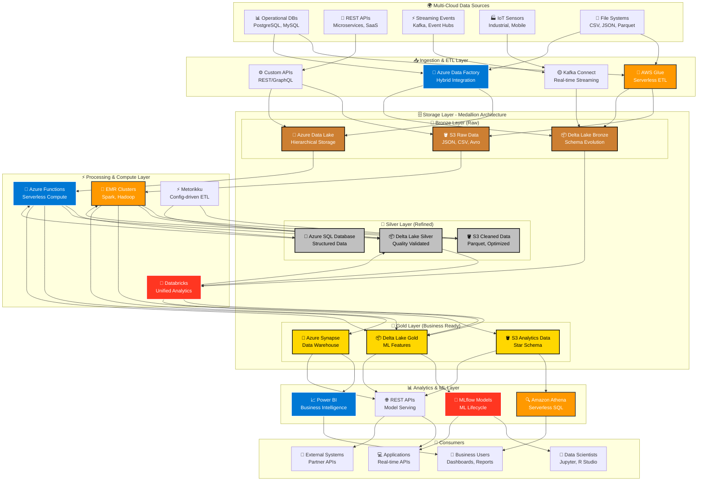
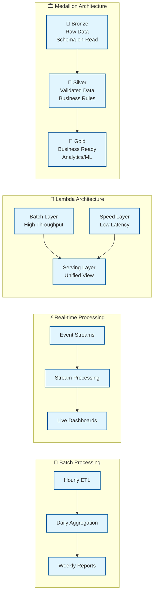
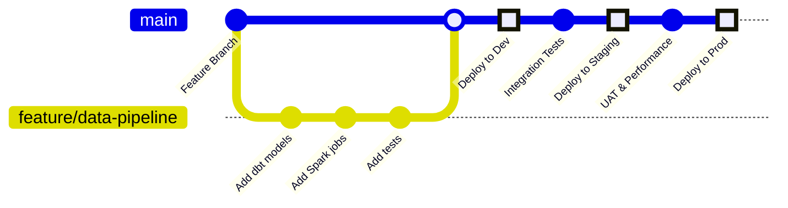
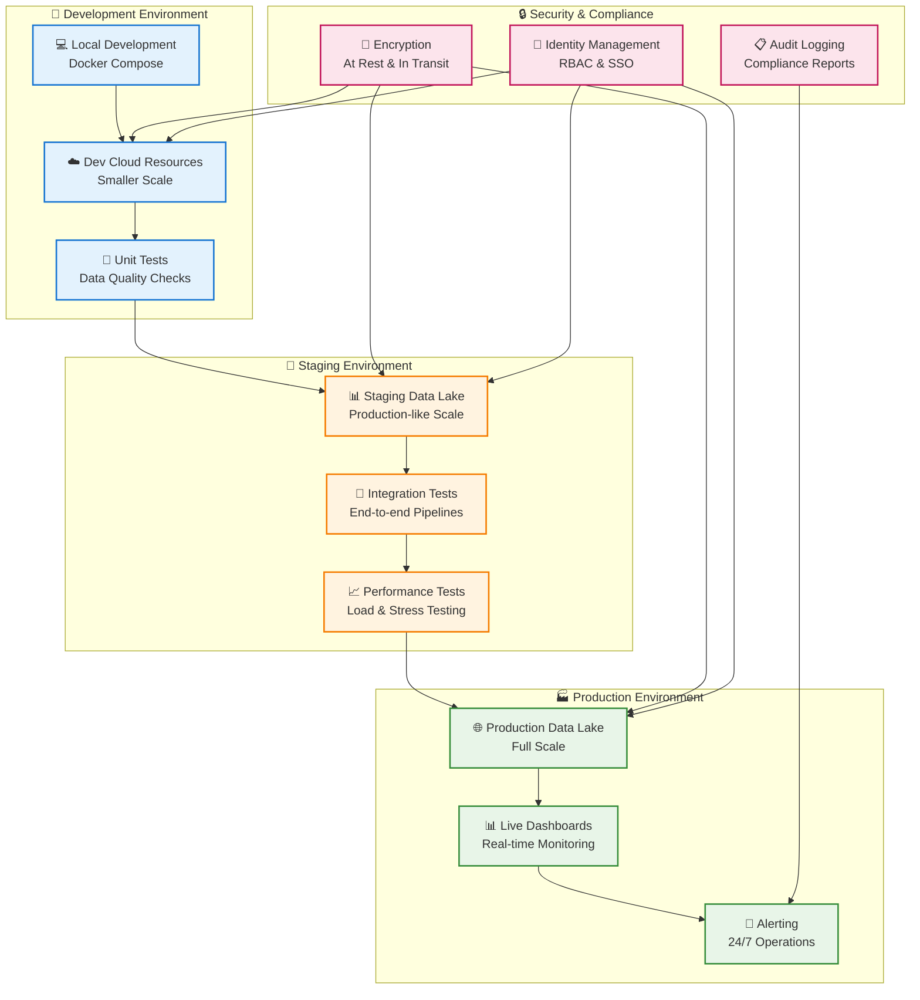
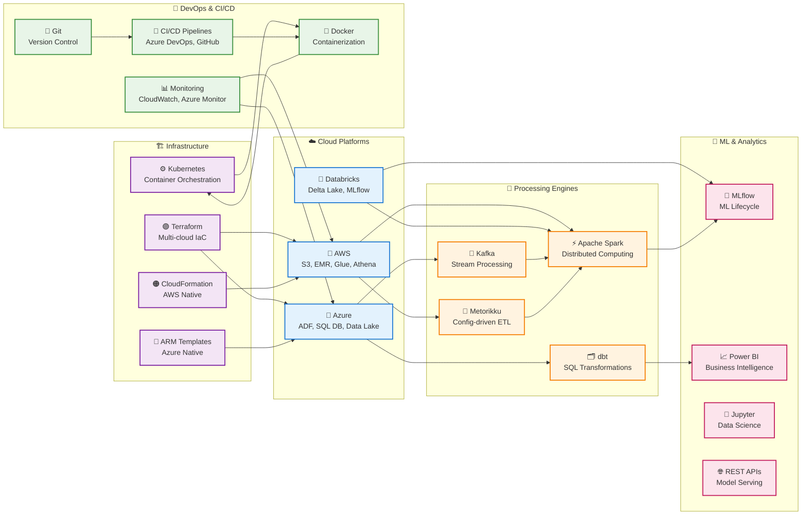

# BigData-Demos: Modern Data Architecture Portfolio

[](https://github.com/your-username/BigData-Demos)
[](LICENSE)
[](https://aws.amazon.com/)
[](https://azure.microsoft.com/)
[](https://databricks.com/)
[](https://terraform.io/)

> **A comprehensive portfolio showcasing modern data architecture, engineering, and analytics across multiple cloud platforms.**

This repository demonstrates practical implementations of data engineering solutions, showcasing expertise in cloud data platforms, big data processing, machine learning, and DevOps practices. Perfect for data architects, engineers, and organizations looking to implement modern data solutions.

## 🎯 Overview

The BigData-Demos repository provides **production-ready examples** of:

- **Multi-cloud data platforms** (AWS, Azure, GCP)
- **Modern data lake architectures** (Bronze/Silver/Gold medallion)
- **Advanced analytics and machine learning** pipelines
- **Infrastructure as Code** for automated deployments
- **Real-time and batch processing** patterns
- **Data quality and governance** frameworks

## 🏗️ Architecture Overview

### Multi-Cloud Data Platform Architecture



### 📈 Data Flow Patterns



## 📁 Repository Structure

```
BigData-Demos/
├── 📂 Cloud Platform/
│   ├── 🔶 aws/                     # AWS Data Lake Architecture
│   │   ├── infrastructure/         # CloudFormation templates
│   │   ├── glue-jobs/             # ETL job scripts
│   │   ├── emr-jobs/              # Big data processing
│   │   └── sample-data/           # Test datasets
│   │
│   ├── 🔴 databricks/             # Databricks Analytics Platform
│   │   ├── 01_data_ingestion_bronze.py
│   │   ├── 02_data_quality_silver.py
│   │   ├── 03_business_intelligence_gold.py
│   │   └── advanced-ml-notebooks/
│   │
│   └── 🟨 dbt/                    # dbt Data Transformation
│       ├── models/                # Data models (staging, intermediate, marts)
│       ├── macros/                # Reusable SQL functions
│       ├── tests/                 # Data quality tests
│       └── docs/                  # Documentation and lineage
│
├── 📂 DevOps Solution/
│   ├── 🔵 Azure/                  # Azure Data Platform
│   │   ├── data-factory/          # ADF pipelines
│   │   ├── arm-templates/         # Infrastructure templates
│   │   └── powershell-scripts/    # Automation scripts
│   │
│   └── 🟦 Templating/             # Infrastructure as Code
│       ├── terraform/             # Multi-cloud IaC
│       ├── arm-templates/         # Azure ARM
│       ├── cloudformation/        # AWS CloudFormation
│       └── helm-charts/           # Kubernetes deployments
│
└── 📂 Spark Application/
    └── ⚡ metorikku/              # Advanced Spark ETL
        ├── config/                # Pipeline configurations
        ├── jdbc/                  # Database integration
        ├── s3/                    # Data lake processing
        └── deployment/            # Production deployment
```

## 🚀 Quick Start

### Prerequisites

```bash
# Required Tools
aws --version          # AWS CLI
az --version           # Azure CLI  
terraform --version    # Infrastructure as Code
docker --version       # Containerization
python --version       # Python 3.8+
java --version         # Java 8/11 for Spark
```

### 1. AWS Data Lake Setup

```bash
# Deploy AWS infrastructure
cd "Cloud Platform/aws/infrastructure"
aws cloudformation create-stack \
  --stack-name data-lake-demo \
  --template-body file://data-lake-stack.yaml \
  --capabilities CAPABILITY_IAM

# Upload sample data
python sample-data/generate-sample-data.py --upload-to-s3 --s3-bucket your-bucket
```

### 2. Azure Data Platform Setup

```bash
# Deploy Azure infrastructure
cd "DevOps Solution/Azure/arm-templates"
az deployment group create \
  --resource-group myResourceGroup \
  --template-file azure-data-platform.json \
  --parameters administratorLogin=sqladmin administratorLoginPassword=SecurePass123!
```

### 3. Databricks Analytics

```bash
# Import notebooks to Databricks workspace
databricks workspace import_dir \
  "Cloud Platform/databricks" \
  /Workspace/BigData-Demos \
  --language PYTHON
```

### 4. Terraform Multi-Cloud

```bash
# Deploy with Terraform
cd "DevOps Solution/Templating/terraform/aws/data-lake"
terraform init
terraform plan -var-file="environments/dev.tfvars"
terraform apply
```

## 🚀 Deployment Patterns

### CI/CD Pipeline Flow



### Multi-Environment Architecture



## 💡 Use Cases & Demos

### 1. 🛒 E-commerce Analytics Platform
**Location**: `Cloud Platform/aws/` & `Cloud Platform/databricks/`

- **Customer 360° view** with unified data from multiple sources
- **Real-time recommendation engine** using collaborative filtering
- **Churn prediction** with machine learning models
- **Revenue optimization** through advanced analytics

**Technologies**: AWS S3, Glue, EMR, Databricks, Delta Lake, MLflow

### 2. 🏭 IoT Data Processing Pipeline
**Location**: `Cloud Platform/aws/emr-jobs/` & `Spark Application/metorikku/`

- **Real-time sensor data ingestion** with Kafka and Kinesis
- **Anomaly detection** using statistical and ML methods
- **Predictive maintenance** models for operational efficiency
- **Operational dashboards** with real-time KPIs

**Technologies**: Apache Spark, Kafka, Metorikku, Time Series Analysis

### 3. 💼 Financial Data Warehouse
**Location**: `DevOps Solution/Azure/` & `DevOps Solution/Templating/`

- **Regulatory reporting** with automated compliance checks
- **Risk analytics** with real-time fraud detection
- **Customer segmentation** for targeted marketing
- **Performance dashboards** for executive reporting

**Technologies**: Azure SQL Database, Data Factory, Power BI, ARM Templates

### 4. 🏥 Healthcare Data Lake
**Location**: Multi-platform implementation

- **Patient analytics** with privacy-preserving techniques
- **Clinical decision support** with ML-powered insights
- **Operational efficiency** through resource optimization
- **Population health** analytics and reporting

**Technologies**: Multi-cloud deployment, HIPAA compliance, Advanced encryption

## 🛠️ Technologies Demonstrated

### Technology Integration Matrix



### Platform-Specific Capabilities

| Platform | Storage | Processing | Analytics | ML/AI | Monitoring |
|----------|---------|------------|-----------|-------|------------|
| **🔶 AWS** | S3 Data Lake<br/>Glacier Archive | EMR Spark<br/>Glue ETL<br/>EKS Jobs | Athena<br/>QuickSight | SageMaker<br/>Comprehend | CloudWatch<br/>X-Ray |
| **🔵 Azure** | Data Lake Gen2<br/>SQL Database | Data Factory<br/>Functions<br/>Synapse | Power BI<br/>Analysis Services | ML Studio<br/>Cognitive Services | Monitor<br/>Application Insights |
| **🔴 Databricks** | Delta Lake<br/>Unity Catalog | Spark Clusters<br/>Delta Live Tables | SQL Analytics<br/>Notebooks | MLflow<br/>AutoML<br/>Feature Store | Cluster Metrics<br/>Job Monitoring |

### Data Architecture Patterns

```
🏛️ PATTERN IMPLEMENTATIONS ACROSS PLATFORMS

┌─────────────────────────────────────────────────────────────────┐
│                    🥇 MEDALLION ARCHITECTURE                    │
├─────────────────────────────────────────────────────────────────┤
│  AWS Implementation    │  Azure Implementation  │  Databricks    │
│  ┌─────────────────┐   │  ┌─────────────────┐   │  ┌─────────────┐ │
│  │ 🥉 S3 Bronze    │   │  │ 🥉 Raw Zone     │   │  │ 🥉 Bronze   │ │
│  │ • JSON/CSV      │   │  │ • Landing       │   │  │ • Auto      │ │
│  │ • Partitioned   │   │  │ • Incremental   │   │  │   Loader    │ │
│  └─────────────────┘   │  └─────────────────┘   │  └─────────────┘ │
│  ┌─────────────────┐   │  ┌─────────────────┐   │  ┌─────────────┐ │
│  │ 🥈 S3 Silver    │   │  │ 🥈 Refined      │   │  │ 🥈 Silver   │ │
│  │ • Parquet       │   │  │ • Validated     │   │  │ • DQ Rules  │ │
│  │ • Optimized     │   │  │ • Cleansed      │   │  │ • Schema    │ │
│  └─────────────────┘   │  └─────────────────┘   │  └─────────────┘ │
│  ┌─────────────────┐   │  ┌─────────────────┐   │  ┌─────────────┐ │
│  │ 🥇 S3 Gold      │   │  │ 🥇 Curated      │   │  │ 🥇 Gold     │ │
│  │ • Star Schema   │   │  │ • Analytics     │   │  │ • ML Ready  │ │
│  │ • Aggregated    │   │  │ • Dimensional   │   │  │ • Features  │ │
│  └─────────────────┘   │  └─────────────────┘   │  └─────────────┘ │
└─────────────────────────────────────────────────────────────────┘

┌─────────────────────────────────────────────────────────────────┐
│                    ⚡ LAMBDA ARCHITECTURE                       │
├─────────────────────────────────────────────────────────────────┤
│                                                                 │
│  📊 BATCH LAYER           ⚡ SPEED LAYER         🎯 SERVING      │
│                                                                 │
│  High Throughput          Low Latency            Unified View   │
│  Historical Accuracy      Real-time Approx       Query Layer   │
│                                                                 │
│  • S3 + EMR              • Kinesis + Lambda      • Athena      │
│  • ADLS + Synapse        • Event Hub + Stream    • Power BI    │
│  • Delta + Spark         • Delta Live Tables     • Dashboards  │
│                                                                 │
└─────────────────────────────────────────────────────────────────┘
```

## 📊 Key Features

### 🔐 Enterprise Security
- **Encryption** at rest and in transit
- **Identity & Access Management** with least privilege
- **Network isolation** with VPCs and private endpoints
- **Compliance** frameworks (GDPR, HIPAA, SOX)

### 📈 Scalability & Performance
- **Auto-scaling** compute resources based on demand
- **Partitioning strategies** for optimal query performance
- **Caching layers** for frequently accessed data
- **Cost optimization** with intelligent tiering

### 🔍 Data Quality & Governance
- **Data lineage** tracking and impact analysis
- **Quality checks** with automated validation rules
- **Schema evolution** handling and version control
- **Master data management** with golden records

### 📱 Real-time Processing
- **Streaming analytics** with Kafka and Kinesis
- **Event-driven architectures** with serverless functions
- **Real-time dashboards** and alerting systems
- **Low-latency APIs** for operational applications

## 🎓 Learning Outcomes

By exploring this repository, you'll gain expertise in:

1. **Modern Data Architecture** - Design scalable, resilient data platforms
2. **Cloud Data Engineering** - Implement solutions across AWS, Azure, and GCP
3. **Advanced Analytics** - Build ML pipelines and real-time analytics
4. **DevOps for Data** - Automate deployment and monitoring of data systems
5. **Data Governance** - Implement security, quality, and compliance frameworks

## 📚 Documentation

### Detailed Guides
- [AWS Data Lake Implementation](Cloud%20Platform/aws/README.md)
- [Databricks Analytics Platform](Cloud%20Platform/databricks/README.md)
- [Azure Data Engineering](DevOps%20Solution/Azure/README.md)
- [Infrastructure as Code](DevOps%20Solution/Templating/README.md)
- [Spark ETL with Metorikku](Spark%20Application/metorikku/README.md)

### Architecture Deep Dives
- [Data Lake Medallion Architecture](docs/medallion-architecture.md)
- [Real-time Analytics Patterns](docs/streaming-patterns.md)
- [ML Operations Best Practices](docs/mlops-guidelines.md)
- [Security Implementation Guide](docs/security-guide.md)

### Tutorials & Workshops
- [End-to-End Data Pipeline Tutorial](tutorials/e2e-pipeline.md)
- [Customer Analytics Workshop](tutorials/customer-analytics.md)
- [Real-time Processing Workshop](tutorials/streaming-workshop.md)
- [Infrastructure Automation Tutorial](tutorials/iac-tutorial.md)


## 🔗 Resources & References

### Official Documentation
- [AWS Big Data Services](https://aws.amazon.com/big-data/)
- [Azure Analytics Services](https://azure.microsoft.com/en-us/solutions/analytics/)
- [Databricks Documentation](https://docs.databricks.com/)
- [Apache Spark Documentation](https://spark.apache.org/docs/latest/)

### Best Practices Guides
- [Data Lake Best Practices](https://aws.amazon.com/blogs/big-data/best-practices-for-building-a-data-lake/)
- [Databricks Best Practices](https://docs.databricks.com/best-practices/index.html)
- [Azure Data Architecture](https://docs.microsoft.com/en-us/azure/architecture/data-guide/)

### Community & Support
- [Data Engineering Community](https://www.reddit.com/r/dataengineering/)
- [Apache Spark User Mailing List](https://spark.apache.org/community.html)
- [Databricks Community](https://community.databricks.com/)